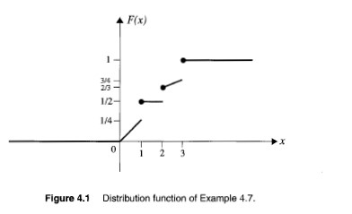
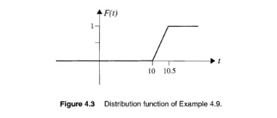

# 4.2 分佈函數 (Distribution Functions)

---

## 📖 原文

### Def: If $X$ is a random variable, then the function $F$ defined on $(-\infty, +\infty)$ by $F_X(t) = F(t)$ is called the **(cumulative) distribution function** of $X$, or **CDF** of $X$, where

$$F_X(t) = F(t) = P(X \le t)$$

### Properties of the distribution functions:

1. $F$ is nondecreasing; that is, if $t < u$, then $F(t) \le F(u)$.
2. $\lim_{t \to \infty} F(t) = 1$
3. $\lim_{t \to -\infty} F(t) = 0$
4. $F$ is right continuous; that is, for every $t \in \mathbb{R}$, $F(t+) = F(t)$

### Event Probability Table (in terms of $F$):

| Event concerning $X$ | Probability in terms of $F$ | Event concerning $X$ | Probability in terms of $F$ |
|---|---|---|---|
| $X \le a$ | $F(a)$ | $a < X \le b$ | $F(b) - F(a)$ |
| $X > a$ | $1 - F(a)$ | $a < X < b$ | $F(b-) - F(a)$ |
| $X < a$ | $F(a-)$ | $a \le X \le b$ | $F(b) - F(a-)$ |
| $X \ge a$ | $1 - F(a-)$ | $a \le X < b$ | $F(b-) - F(a-)$ |
| $X = a$ | $F(a) - F(a-)$ | | |

> Note: $F(t-)$ denotes the left limit $\lim_{s \to t^-} F(s)$.

---

## 🇹🇼 中文翻譯

### 定義：若 $X$ 是隨機變數，則定義在 $(-\infty, +\infty)$ 上的函數 $F_X(t) = F(t)$ 稱為 $X$ 的**(累積)分佈函數**或 **CDF**，其中

$$F_X(t) = F(t) = P(X \le t)$$

### 分佈函數的性質：

1. $F$ 是非遞減的；即若 $t < u$，則 $F(t) \le F(u)$。
2. $\lim_{t \to \infty} F(t) = 1$
3. $\lim_{t \to -\infty} F(t) = 0$
4. $F$ 是右連續的；即對每個實數 $t$，$F(t+) = F(t)$

### 事件機率表（用 $F$ 表示）：

| 關於 $X$ 的事件 | 以 $F$ 表示的機率 | 關於 $X$ 的事件 | 以 $F$ 表示的機率 |
|---|---|---|---|
| $X \le a$ | $F(a)$ | $a < X \le b$ | $F(b) - F(a)$ |
| $X > a$ | $1 - F(a)$ | $a < X < b$ | $F(b-) - F(a)$ |
| $X < a$ | $F(a-)$ | $a \le X \le b$ | $F(b) - F(a-)$ |
| $X \ge a$ | $1 - F(a-)$ | $a \le X < b$ | $F(b-) - F(a-)$ |
| $X = a$ | $F(a) - F(a-)$ | | |

> 注意：$F(t-)$ 表示左極限 $\lim_{s \to t^-} F(s)$。

---

## 💡 中文詳細解釋

**累積分佈函數 (CDF)** 是機率論中最基本的工具之一。它告訴我們「隨機變數小於或等於某個值 $t$」的機率是多少。

### 四個性質的直觀理解：

1. **非遞減性**：$t$ 越大，$X \le t$ 的事件包含的結果越多，所以機率不會減少。
2. **趨近 1**：當 $t \to \infty$ 時，「$X \le t$」幾乎涵蓋所有可能結果，機率趨近 1。
3. **趨近 0**：當 $t \to -\infty$ 時，「$X \le t$」幾乎不可能發生，機率趨近 0。
4. **右連續性**：這是 CDF 的定義要求（包含等號），確保 $F(t) = P(X \le t)$。

### $F(a-)$ 是什麼？

$F(a-) = \lim_{t \to a^-} F(t)$，即從左側逼近 $a$ 時的極限值。
- **離散隨機變數**：在跳躍點，$F(a) \neq F(a-)$，差值就是 $P(X=a)$。
- **連續隨機變數**：$F$ 是連續的，所以 $F(a) = F(a-)$，$P(X=a) = 0$。

---

## 📝 Ex 4.7 — CDF 計算練習

### 📖 原文

The distribution function of a random variable $X$ is given by:

$$
F(x) = \begin{cases}
0 & x < 0 \\[6pt]
\dfrac{x}{4} & 0 \le x < 1 \\[6pt]
\dfrac{1}{2} & 1 \le x < 2 \\[6pt]
\dfrac{x}{12} + \dfrac{1}{2} & 2 \le x < 3 \\[6pt]
1 & x \ge 3
\end{cases}
$$



Compute the following quantities:
(a) $P(X<2) = \frac{1}{2}$
(b) $P(X=2) = \frac{2}{3} - \frac{1}{2}$
(c) $P(1\le X<3) = P(X<3) - P(X<1)$
(d) $P(X>3/2) = 1 - F(3/2)$
(e) $P(X=5/2) = F(5/2) - P(X<5/2)$
(f) $P(2<X\le 7) = F(7) - F(2) = 1 - \frac{2}{3}$

---

### 🇹🇼 中文翻譯

隨機變數 $X$ 的分佈函數為：

$$
F(x) = \begin{cases}
0 & x < 0 \\[6pt]
\dfrac{x}{4} & 0 \le x < 1 \\[6pt]
\dfrac{1}{2} & 1 \le x < 2 \\[6pt]
\dfrac{x}{12} + \dfrac{1}{2} & 2 \le x < 3 \\[6pt]
1 & x \ge 3
\end{cases}
$$

計算以下機率：
(a) $P(X<2) = \frac{1}{2}$
(b) $P(X=2) = \frac{2}{3} - \frac{1}{2}$
(c) $P(1\le X<3) = P(X<3) - P(X<1)$
(d) $P(X>3/2) = 1 - F(3/2)$
(e) $P(X=5/2) = F(5/2) - P(X<5/2)$
(f) $P(2<X\le 7) = F(7) - F(2) = 1 - \frac{2}{3}$

---

### 💡 中文詳細解釋與推導過程

這個 CDF 是一個**混合型分佈**——既有連續部分也有離散跳躍：

```
x:    ...   0     1       2         3   ...
F(x):  0 ──→ 1/4 ─┐ 1/2 ──→ 2/3 ───→ 1
                  ↓跳躍  連續上升
                P(X=1)=1/4
```

**逐題推導：**

**(a) $P(X<2) = F(2-) = \lim_{x \to 2^-} F(x)$**
- $x < 2$ 時，$F(x) = \frac{1}{2}$（在區間 $[1,2)$）
- **答案：$P(X<2) = \dfrac{1}{2}$**

**(b) $P(X=2) = F(2) - F(2-)$**
- $F(2) = \frac{2}{12} + \frac{1}{2} = \frac{1}{6} + \frac{1}{2} = \frac{2}{3}$
- $F(2-) = \frac{1}{2}$（從左側逼近）
- **答案：$P(X=2) = \dfrac{2}{3} - \dfrac{1}{2} = \dfrac{1}{6}$**

**(c) $P(1\le X<3) = P(X<3) - P(X<1)$**
- $P(X<3) = F(3-) = \lim_{x \to 3^-} \left(\frac{x}{12} + \frac{1}{2}\right) = \frac{3}{12} + \frac{1}{2} = \frac{5}{6}$
- $P(X<1) = F(1-) = \lim_{x \to 1^-} \frac{x}{4} = \frac{1}{4}$
- **答案：$P(1\le X<3) = \dfrac{5}{6} - \dfrac{1}{4} = \dfrac{7}{12}$**

**(d) $P(X>3/2) = 1 - F(3/2)$**
- $F(3/2) = \frac{1}{2}$（因為 $1 \le \frac{3}{2} < 2$）
- **答案：$P(X>3/2) = 1 - \dfrac{1}{2} = \dfrac{1}{2}$**

**(e) $P(X=5/2) = F(5/2) - F(5/2-)$**
- 在 $x=\frac{5}{2}$ 附近，$F(x) = \frac{x}{12} + \frac{1}{2}$ 是連續的
- **答案：$P(X=5/2) = 0$**（連續部分沒有點機率）

**(f) $P(2<X\le 7) = F(7) - F(2)$**
- $F(7) = 1$（因為 $7 \ge 3$）
- $F(2) = \frac{2}{3}$
- **答案：$P(2<X\le 7) = 1 - \dfrac{2}{3} = \dfrac{1}{3}$**

---

## 📝 Ex 4.9 — 公車到站時間

### 📖 原文

Suppose that a bus arrives at a station every day between 10:00 A.M. and 10:30 A.M., at random. Let $X$ be the arrival time; find the distribution function of $X$ and sketch its graph.

Ans:
$$
F(t) = \begin{cases}
0 & t < 10 \\[6pt]
2(t - 10) & 10 \le t < 10.5 \\[6pt]
1 & t \ge 10.5
\end{cases}
$$



---

### 🇹🇼 中文翻譯

假設公車每天在上午 10:00 到 10:30 之間隨機到達車站。令 $X$ 為到達時間；求 $X$ 的分佈函數並繪製其圖形。

答案：
$$
F(t) = \begin{cases}
0 & t < 10 \\[6pt]
2(t - 10) & 10 \le t < 10.5 \\[6pt]
1 & t \ge 10.5
\end{cases}
$$

---

### 💡 中文詳細解釋與推導過程

這是一個**均勻分佈 (Uniform Distribution)** 的例子：

- $X \sim \text{Uniform}(10, 10.5)$，即公車在 $[10:00, 10:30]$ 之間等機率到達
- 機率密度函數 $f(t) = \dfrac{1}{10.5 - 10} = 2$（在區間內）

**CDF 推導：**

$$F(t) = P(X \le t) = \int_{10}^{t} f(u)\,du = \int_{10}^{t} 2\,du = 2(t - 10), \quad \text{當 } 10 \le t < 10.5$$

- $t < 10$：公車還沒可能到達，$F(t) = 0$
- $10 \le t < 10.5$：$F(t) = 2(t - 10)$，線性增長
- $t \ge 10.5$：公車一定已經到達，$F(t) = 1$

> 💡 **關鍵理解**：均勻分佈的 CDF 是一條直線（斜率 $= 1/\text{區間長度}$），因為每個時間點被選中的機率相同。

---
