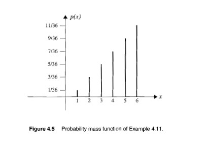
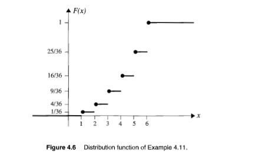

# 4.3 離散隨機變數 (Discrete Random Variables)

---

## 📖 原文

### Def: Whenever the set of possible values that a random variable $X$ can assume is **at most countable**, $X$ is called **discrete**.

#### Examples of set measure:
- **Finite set**: $\{0, 1, 2\}$
- **Countably infinite set**: $\{1, 2, 3, 4, \ldots\}$
- **Uncountable set**: $\{x : x \ge 0\}$

> Note: finite must be countable.

### Def: The **probability mass function (p.m.f)** $p$ of a discrete random variable $X$ whose set of possible values is $\{x_1, x_2, x_3, \ldots\}$ is a function from $\mathbb{R}$ to $\mathbb{R}$ that satisfies the following properties:

(a) $p(x) = 0$ if $x \notin \{x_1, x_2, x_3, \ldots\}$
(b) $p(x_i) = P(X = x_i)$ and hence $p(x_i) \ge 0$
(c) $\displaystyle\sum_{i=1}^{\infty} p(x_i) = 1$

---

## 🇹🇼 中文翻譯

### 定義：若隨機變數 $X$ 可能取值的集合是**可數的 (countable)**，則稱 $X$ 為**離散的**。

#### 集合測度範例：
- **有限集**：$\{0, 1, 2\}$
- **可數無限集**：$\{1, 2, 3, 4, \ldots\}$
- **不可數集**：$\{x : x \ge 0\}$

> 注意：有限集合一定是可數的。

### 定義：**機率質量函數 (probability mass function, p.m.f)** $p$ 是離散隨機變數 $X$（可能取值為 $\{x_1, x_2, x_3, \ldots\}$）從 $\mathbb{R}$ 到 $\mathbb{R}$ 的函數，滿足以下性質：

(a) 若 $x \notin \{x_1, x_2, x_3, \ldots\}$，則 $p(x) = 0$
(b) $p(x_i) = P(X = x_i)$，因此 $p(x_i) \ge 0$
(c) $\displaystyle\sum_{i=1}^{\infty} p(x_i) = 1$

---

## 💡 中文詳細解釋

### 離散 vs. 連續隨機變數

| 特性 | 離散 (Discrete) | 連續 (Continuous) |
|------|-----------------|-------------------|
| 可能取值 | 可數個（有限或可列無限） | 不可數個（區間上的所有實數） |
| 機率描述 | PMF: $p(x) = P(X=x)$ | PDF: $f(x)$，$P(X=x)=0$ |
| 累積函數 | CDF 有跳躍 | CDF 連續 |

### PMF 的三個性質：

1. **非取值點為零**：$X$ 不可能取的值，機率為 0。
2. **非負性**：機率永遠 $\ge 0$。
3. **總和為 1**：所有可能值的機率加起來等於 1（必然事件）。

---

## 📝 Ex 4.11 — 擲骰子最大值

### 📖 原文

Roll a fair die twice. Let $X$ be the maximum of the two numbers obtained. Determine the **probability mass function** and the **cumulative distribution function** of $X$.

Sol: The sample space is $\{(1,1), (1,2), \ldots, (1,6), (2,1), (2,2), \ldots, (2,6), \ldots, (6,1), (6,2), \ldots, (6,6)\}$, each with $p = 1/36$.

---

### 🇹🇼 中文翻譯

擲一枚公平骰子兩次。令 $X$ 為兩次結果的最大值。求 $X$ 的**機率質量函數**和**累積分佈函數**。

解：樣本空間為 $\{(1,1), (1,2), \ldots, (1,6), (2,1), (2,2), \ldots, (2,6), \ldots, (6,1), (6,2), \ldots, (6,6)\}$，每個結果機率 $= 1/36$。

---

### 💡 中文詳細解釋與推導過程

**PMF 計算：**

$X$ 的可能取值為 $\{1, 2, 3, 4, 5, 6\}$。

$$P(X \le k) = P(\text{兩次都} \le k) = \left(\frac{k}{6}\right)^2 \quad (\text{因為每次獨立，且各有 } k/6 \text{ 機率} \le k)$$

| $X$ | PMF: $p(x) = P(X=x)$ | CDF: $F(x) = P(X\le x)$ |
|---|---------------------|---------------------|
| 1 | $\left(\frac{1}{6}\right)^2 =$ **$\frac{1}{36}$** | $\left(\frac{1}{6}\right)^2 =$ **$\frac{1}{36}$** |
| 2 | $\left(\frac{2}{6}\right)^2 - \left(\frac{1}{6}\right)^2 = \frac{4}{36}-\frac{1}{36} =$ **$\frac{3}{36}$** | $\left(\frac{2}{6}\right)^2 =$ **$\frac{4}{36}$** |
| 3 | $\left(\frac{3}{6}\right)^2 - \left(\frac{2}{6}\right)^2 = \frac{9}{36}-\frac{4}{36} =$ **$\frac{5}{36}$** | $\left(\frac{3}{6}\right)^2 =$ **$\frac{9}{36}$** |
| 4 | $\left(\frac{4}{6}\right)^2 - \left(\frac{3}{6}\right)^2 = \frac{16}{36}-\frac{9}{36} =$ **$\frac{7}{36}$** | $\left(\frac{4}{6}\right)^2 =$ **$\frac{16}{36}$** |
| 5 | $\left(\frac{5}{6}\right)^2 - \left(\frac{4}{6}\right)^2 = \frac{25}{36}-\frac{16}{36} =$ **$\frac{9}{36}$** | $\left(\frac{5}{6}\right)^2 =$ **$\frac{25}{36}$** |
| 6 | $\left(\frac{6}{6}\right)^2 - \left(\frac{5}{6}\right)^2 = \frac{36}{36}-\frac{25}{36} =$ **$\frac{11}{36}$** | $\left(\frac{6}{6}\right)^2 =$ **$\frac{36}{36}=1$** |

> ✅ 驗證：$\sum p(x) = \frac{1+3+5+7+9+11}{36} = \frac{36}{36} = 1$ ✓

**規律**：$p(k) = k^2 - (k-1)^2 = 2k - 1$（分子），所以 PMF 為奇數序列。

---

## 📝 Ex 4.12 — 幾何級數 PMF

### 📖 原文

Can a function of the form:
$$
p(x) = \begin{cases}
c\left(\dfrac{2}{3}\right)^x & x = 1, 2, 3, \ldots \\[6pt]
0 & \text{elsewhere}
\end{cases}
$$
be a probability mass function?

Sol: Yes, if we let $\sum p(x) = 1 \Rightarrow c \times \displaystyle\sum_{i=1}^{\infty} \left(\frac{2}{3}\right)^i = 1$

$$c \times \left[\dfrac{2/3}{1-2/3}\right] = c \times 2 = 1 \Rightarrow \mathbf{c = \frac{1}{2}}$$

---

### 🇹🇼 中文翻譯

以下形式的函數能否成為機率質量函數？
$$
p(x) = \begin{cases}
c\left(\dfrac{2}{3}\right)^x & x = 1, 2, 3, \ldots \\[6pt]
0 & \text{其他情況}
\end{cases}
$$

解：可以，只要令 $\sum p(x) = 1 \Rightarrow c \times \displaystyle\sum_{i=1}^{\infty} \left(\frac{2}{3}\right)^i = 1$

$$c \times \left[\dfrac{2/3}{1-2/3}\right] = c \times 2 = 1 \Rightarrow \mathbf{c = \frac{1}{2}}$$

---

### 💡 中文詳細解釋與推導過程

要成為 PMF，必須滿足：
1. $p(x) \ge 0$ ✓（因為 $c > 0$, $\left(\frac{2}{3}\right)^x > 0$）
2. $\sum p(x) = 1$（需要確定 $c$）

**幾何級數求和：**

$$\sum_{i=1}^{\infty} r^i = \frac{r}{1-r}, \quad \text{當 } |r| < 1$$

這裡 $r = \frac{2}{3}$：
- $\displaystyle\sum_{i=1}^{\infty} \left(\frac{2}{3}\right)^i = \dfrac{2/3}{1 - 2/3} = \dfrac{2/3}{1/3} =$ **$2$**

所以 $c \times 2 = 1 \Rightarrow$ **$c = \frac{1}{2}$**

> 💡 這是一個**幾何分佈的變體**。標準幾何分佈 $p(k) = (1-p)^{k-1} \cdot p$，這裡的形式略有不同但本質相同。

---
