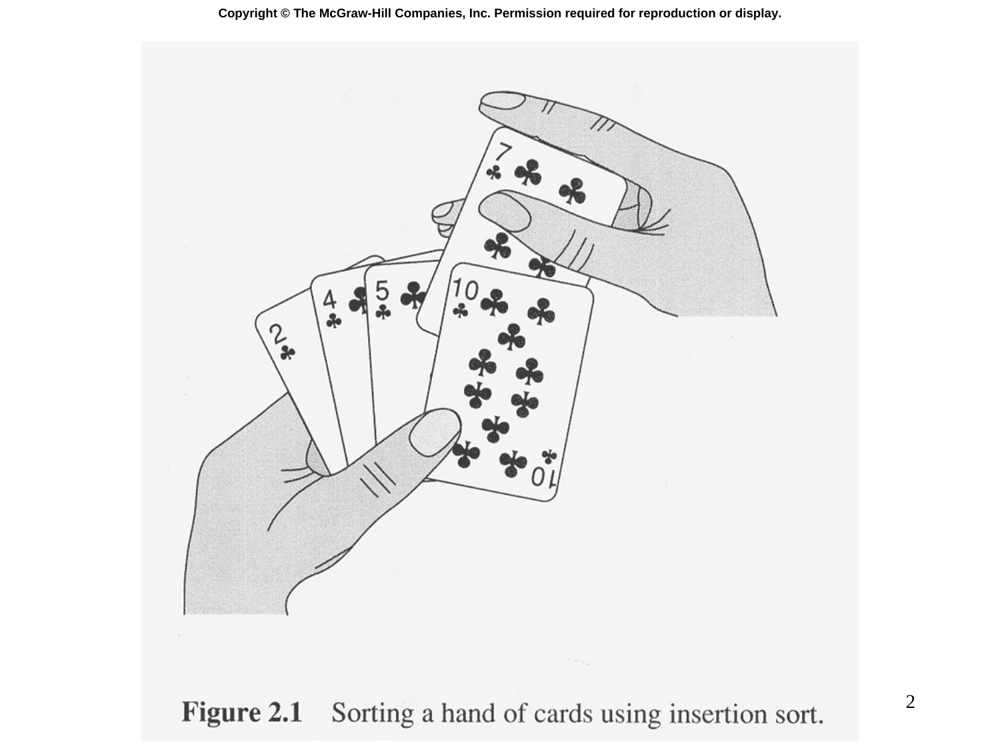

# Slide 02 — Sorting Problem (排序問題)

## 📖 Original Text / 原文

### 🖼️ Original Slides / 原始投影片



---

**Figure 2.1** Sorting a hand of cards using insertion sort.

## 🇹🇼 Chinese Translation / 中文翻譯

**圖 2.1** 使用插入排序對一手撲克牌進行排序。

## 💡 Detailed Explanation / 詳細解釋

這張投影片用「整理撲克牌」的比喻來介紹**插入排序**的直覺：

- 想像你手中拿著一副已經部分排序的牌
- 每當拿到一張新牌時，你從右到左掃描已經排好的牌
- 找到新牌應該插入的位置後，將它插入
- 重複這個過程直到所有牌都排序完成

這個日常生活中的操作方式，正是插入排序演算法的核心思想。

## 🔢 Derivation Process / 推導過程

插入排序的擬似碼結構：

```
INSERTION-SORT(A)
  for j = 2 to length[A]
    key = A[j]
    // Insert A[j] into the sorted sequence A[1..j-1]
    i = j - 1
    while i > 0 and A[i] > key
      A[i + 1] = A[i]
      i = i - 1
    A[i + 1] = key
```

其中 $A$ 是待排序的陣列，$A[1..j-1]$ 在每次迭代時已經是排序好的子陣列。
