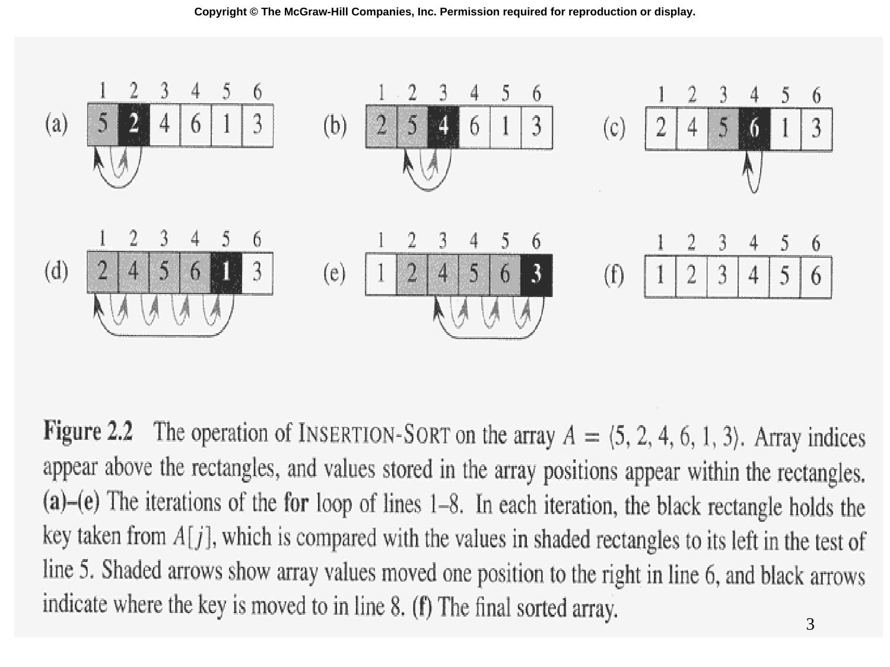

# Slide 03 — Insertion Sort Example (插入排序範例)

## 📖 Original Text / 原文

### 🖼️ Original Slides / 原始投影片

---

**Figure 2.2** The operation of INSERTION-SORT on the array $A = (5, 2, 4, 6, 1, 3)$. Array indices appear above the rectangles, and values stored in the array positions appear within the rectangles. (a)-(e) The iterations of the for loop of lines 1-8. In each iteration, the black rectangle holds the key taken from $A[j]$, which is compared with the values in shaded rectangles to its left in the test of line 5. Shaded arrows show array values moved one position to the right in line 6, and black arrows indicate where the key is moved to in line 8. (f) The final sorted array.

## 🇹🇼 Chinese Translation / 中文翻譯

**圖 2.2** INSERTION-SORT 在陣列 $A = (5, 2, 4, 6, 1, 3)$ 上的操作過程。陣列索引顯示在矩形上方，儲存在陣列位置中的值顯示在矩形內。(a)-(e) 第 1-8 行 for 迴圈的迭代。每次迭代中，黑色矩形存放從 $A[j]$ 取得的 key，在第 5 行的測試中與左側陰影矩形中的值進行比較。陰影箭頭顯示在第 6 行向右移動一個位置的陣列值，黑色箭頭表示 key 在第 8 行被移動到的位置。(f) 最終排序完成的陣列。

## 💡 Detailed Explanation / 詳細解釋

這張圖詳細展示了插入排序對 $A = (5, 2, 4, 6, 1, 3)$ 的完整執行過程：

- **(a)** $j=2$，key = 2。將 2 與 5 比較，5 右移，2 插入位置 1 → $(2, 5, 4, 6, 1, 3)$
- **(b)** $j=3$，key = 4。將 4 與 5 比較，5 右移；4 與 2 比較，4 插入位置 2 → $(2, 4, 5, 6, 1, 3)$
- **(c)** $j=4$，key = 6。6 > 5，不需移動 → $(2, 4, 5, 6, 1, 3)$
- **(d)** $j=5$，key = 1。1 與 6、5、4、2 都比較，全部右移，1 插入位置 1 → $(1, 2, 4, 5, 6, 3)$
- **(e)** $j=6$，key = 3。3 與 6、5、4 比較，全部右移；3 與 2 比較，3 插入位置 2 → $(1, 2, 3, 4, 5, 6)$
- **(f)** 最終排序結果：$(1, 2, 3, 4, 5, 6)$
