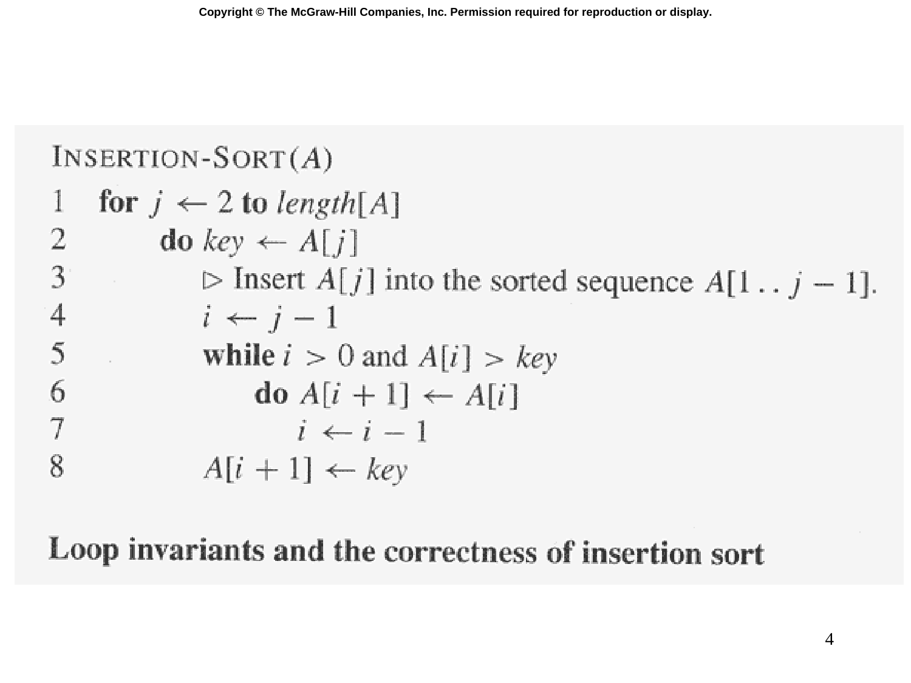

# Slide 04 — INSERTION-SORT Pseudocode (插入排序擬似碼)

## 📖 Original Text / 原文

---



## 🇹🇼 Chinese Translation / 中文翻譯

**插入排序(A)**

```
1  for j ← 2 到 length[A]
2    do key ← A[j]
3    ▷ 將 A[j] 插入已排序的序列 A[1..j-1] 中。
4      i ← j-1
5      while i > 0 且 A[i] > key
6        do A[i+1] ← A[i]
7          i ← i-1
8      A[i+1] ← key
```

**迴圈不變式與插入排序的正確性**

## 💡 Detailed Explanation / 詳細解釋

插入排序的擬似碼解析：

| 行號 | 功能 |
|------|------|
| 第 1 行 | 從第二個元素開始遍歷整個陣列 |
| 第 2 行 | 將當前元素 $A[j]$ 存入 key |
| 第 4 行 | 從 $j-1$ 開始向左掃描 |
| 第 5 行 | 當左側元素大於 key 時，持續向左移動 |
| 第 6 行 | 將較大的元素向右移動一個位置 |
| 第 8 行 | 將 key 插入到正確位置 |

**迴圈不變式（Loop Invariant）**：在第 1 行 for 迴圈的每次迭代開始時，子陣列 $A[1..j-1]$ 包含原來的 $A[1..j-1]$ 的元素，且已排序。這是證明插入排序正確性的關鍵。

## 🔢 Derivation Process / 推導過程

**正確性證明（三要素）**：

1. **初始化（Initialization）**：$j=2$ 時，$A[1..1]$ 只有一個元素，自然是排序好的 ✓
2. **保持（Maintenance）**：假設 $A[1..j-1]$ 已排序，第 2-8 行將 $A[j]$ 插入正確位置，使得 $A[1..j]$ 排序好 ✓
3. **終止（Termination）**：迴圈在 $j = n+1$ 時終止，此時 $A[1..n]$ 已排序 ✓
