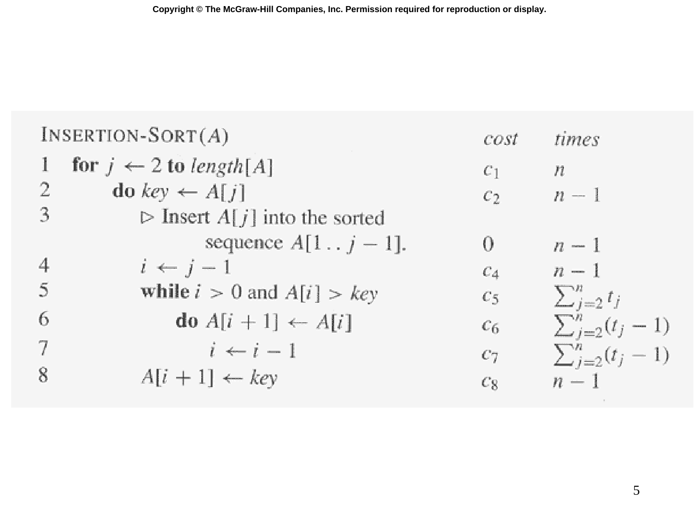

# Slide 05 — Cost Analysis of Insertion Sort (插入排序成本分析)

## 📖 Original Text / 原文

---

## 🇹🇼 Chinese Translation / 中文翻譯

**插入排序(A)**

| 行號 | 敘述 | 單位成本 | 執行次數 |
|------|------|----------|----------|
| 1 | for j ← 2 到 length[A] | c₁ | n |
| 2 | do key ← A[j] | c₂ | n−1 |
| 3 | ▷ 將 A[j] 插入已排序序列 A[1..j−1] | | n−1 |
| 4 | i ← j−1 | c₄ | n−1 |
| 5 | while i > 0 且 A[i] > key | c₅ | Σ(j=2 to n) tⱼ |
| 6 | do A[i+1] ← A[i] | c₆ | Σ(j=2 to n) (tⱼ − 1) |
| 7 | i ← i−1 | c₇ | Σ(j=2 to n) (tⱼ − 1) |
| 8 | A[i+1] ← key | c₈ | n−1 |

## 💡 Detailed Explanation / 詳細解釋

這張投影片展示了插入排序的**逐行成本分析**方法：

- **$c_i$**：第 $i$ 行每次執行的單位成本（constant cost）
- **times**：第 $i$ 行執行的總次數
- **$t_j$**：第 5 行 while 條件對於第 $j$ 次外迴圈迭代的測試次數

總執行時間：

$$T(n) = c_1n + c_2(n-1) + c_4(n-1) + c_5\sum_{j=2}^{n} t_j + c_6\sum_{j=2}^{n} (t_j-1) + c_7\sum_{j=2}^{n} (t_j-1) + c_8(n-1)$$

可以看到，總執行時間取決於 $t_j$ 的值 — 這就是為什麼我們需要分析最佳情況和最壞情況。
