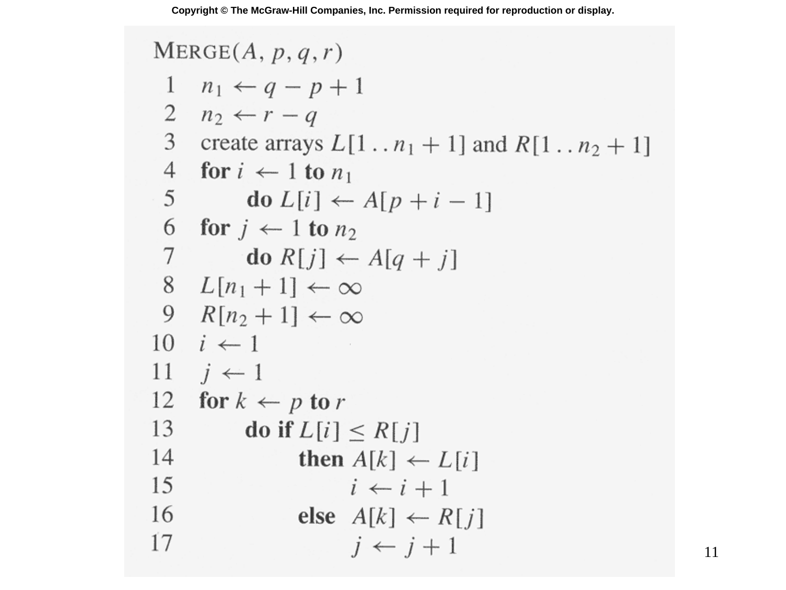

# Slide 11 — MERGE Pseudocode (合併擬似碼)

## 📖 Original Text / 原文

---



## 🇹🇼 Chinese Translation / 中文翻譯

**合併(A, p, q, r)**

```
n₁ ← q - p + 1                  // 左半部大小
n₂ ← r - q                      // 右半部大小

建立陣列 L[1..n₁+1] 和 R[1..n₂+1]

for i ← 1 到 n₁
    L[i] ← A[p+i-1]             // 複製左半部

for j ← 1 到 n₂
    R[j] ← A[q+j]               // 複製右半部

L[n₁+1] ← ∞                     // 左邊界哨兵
R[n₂+1] ← ∞                     // 右邊界哨兵

i ← 1
j ← 1

for k ← p 到 r
    if L[i] ≤ R[j]
        A[k] ← L[i]
        i ← i+1
    else
        A[k] ← R[j]
        j ← j+1
```

## 💡 Detailed Explanation / 詳細解釋

MERGE 是歸併排序的核心程序，負責將**兩個已排序的子陣列**合併為一個排序陣列：

- **$A[p..q]$**：左側已排序子陣列
- **$A[q+1..r]$**：右側已排序子陣列
- **$\infty$ 哨兵（Sentinel）**：在 $L$ 和 $R$ 的末尾放置 $\infty$，避免在合併過程中檢查陣列邊界

**合併過程**：比較 $L[i]$ 和 $R[j]$，將較小者放回 $A[k]$，重複直到完成。

**時間複雜度**：$\Theta(r-p+1) = \Theta(n)$，因為每個元素最多被存取常數次。

## 🔢 Derivation Process / 推導過程

為什麼哨兵很重要？

- 沒有哨兵時，每次迭代需要檢查 $i \leq n_1$ 和 $j \leq n_2$
- 有了哨兵 $\infty$，當一側用完時，另一側的 $\infty$ 永遠不會被選中（因為 $\infty$ 最大）
- 這簡化了條件判斷
