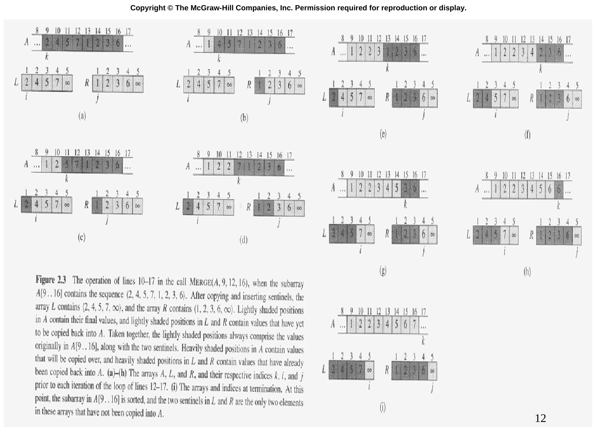

# Slide 12 — MERGE Example (合併範例)

## 📖 Original Text / 原文

### 🖼️ Original Slides / 原始投影片

---

**Figure 2.3** The operation of lines 10-17 in the call MERGE(A, 9, 12, 16), when the subarray $A[1..16]$ contains the sequence $(2, 4, 5, 7, 1, 2, 3, 6)$. After copying and inserting sentinels, the array $L$ contains $(2, 4, 5, 7, \infty)$, and the array $R$ contains $(1, 2, 3, 6, \infty)$. Lightly shaded positions in $A$ contain their final values, and lightly shaded positions in $L$ and $R$ contain values that have yet to be copied back into $A$. Taken together, the lightly shaded positions always comprise the values originally in $A[9..16]$, along with the two sentinels. Heavily shaded positions in $A$ contain values that will be copied over, and heavily shaded positions in $L$ and $R$ contain values that have already been copied back into $A$. (a)-(h) The arrays $A$, $L$, and $R$, and their respective indices $k$, $i$, and $j$ prior to each iteration of the loop of lines 12-17. (i) The arrays and indices at termination. At this point, the subarray in $A[9..16]$ is sorted, and the two sentinels in $L$ and $R$ are the only two elements in these arrays that have not been copied into $A$.

## 🇹🇼 Chinese Translation / 中文翻譯

**圖 2.3** 在呼叫 MERGE(A, 9, 12, 16) 時第 10-17 行的操作過程，子陣列 $A[1..16]$ 包含序列 $(2, 4, 5, 7, 1, 2, 3, 6)$。複製並插入哨兵後，陣列 $L$ 包含 $(2, 4, 5, 7, \infty)$，陣列 $R$ 包含 $(1, 2, 3, 6, \infty)$。(a)-(h) 在第 12-17 行迴圈每次迭代之前的陣列 $A$、$L$、$R$ 及其各自的索引 $k$、$i$、$j$。(i) 終止時的陣列和索引。此時 $A[9..16]$ 中的子陣列已排序，$L$ 和 $R$ 中的兩個哨兵是這些陣列中唯一尚未複製到 $A$ 的元素。

## 💡 Detailed Explanation / 詳細解釋

這張圖展示了 MERGE(A, 9, 12, 16) 的完整過程：

- **左子陣列** $L = (2, 4, 5, 7, \infty)$（來自 $A[9..12]$）
- **右子陣列** $R = (1, 2, 3, 6, \infty)$（來自 $A[13..16]$）

**合併步驟**：

| 步驟 | 比較 | 放入 $A[k]$ | $k$ |
|------|------|------------|-----|
| (a) | $2$ vs $1$ | $1$ | 9 |
| (b) | $2$ vs $2$ | $2$ | 10 |
| (c) | $2$ vs $3$ | $2$ | 11 |
| (d) | $4$ vs $3$ | $3$ | 12 |
| (e) | $4$ vs $6$ | $4$ | 13 |
| (f) | $5$ vs $6$ | $5$ | 14 |
| (g) | $7$ vs $6$ | $6$ | 15 |
| (h) | $7$ vs $\infty$ | $7$ | 16 |

**結果**：$A[9..16] = (1, 2, 2, 3, 4, 5, 6, 7)$ ✓
