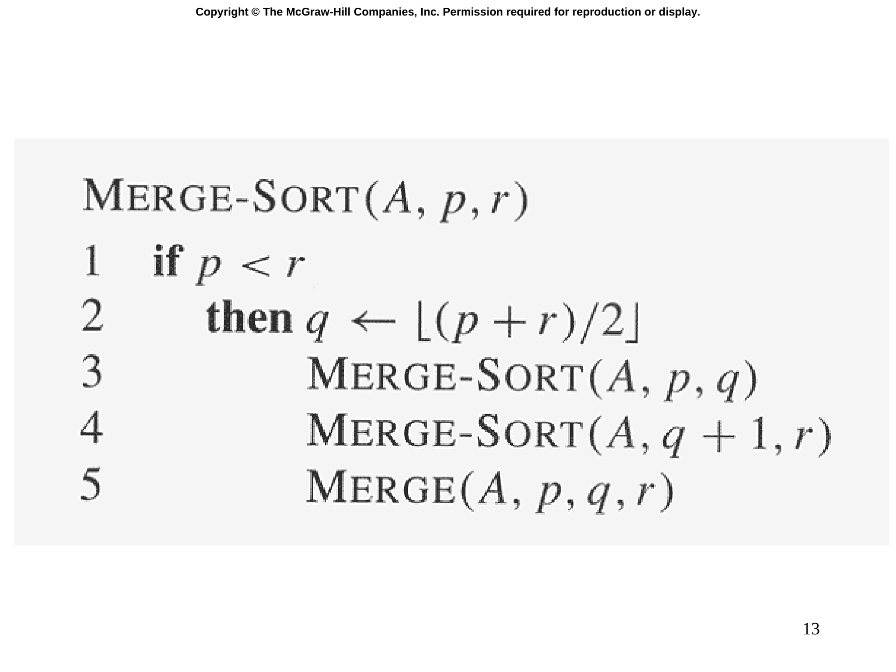

# Slide 13 — MERGE-SORT Pseudocode (歸併排序擬似碼)

## 📖 Original Text / 原文

---



## 🇹🇼 Chinese Translation / 中文翻譯

**歸併排序(A, p, r)**

```
1   if p < r                      (基底情況：子陣列有 0 或 1 個元素)
2     then q ← ⌊(p+r)/2⌋          (計算中點)
3       MERGE-SORT(A, p, q)       (遞迴排序左半部)
4       MERGE-SORT(A, q+1, r)     (遞迴排序右半部)
5       MERGE(A, p, q, r)         (合併兩個已排序子陣列)
```

## 💡 Detailed Explanation / 詳細解釋

歸併排序是**分治法**的完美範例：

| 分治步驟 | 對應行號 | 說明 |
|---------|---------|------|
| **Divide** | 第 2 行 | 計算中點 $q = \lfloor (p+r)/2 \rfloor$，將陣列分為兩半 |
| **Conquer** | 第 3-4 行 | 遞迴排序左右兩個子陣列 |
| **Combine** | 第 5 行 | 呼叫 MERGE 合併兩個已排序子陣列 |

**基底情況**：當 $p \geq r$ 時（子陣列有 0 或 1 個元素），自然已排序，直接回傳。

**遞迴式**：

$$T(n) = \begin{cases} \Theta(1), & \text{if } n = 1 \\ 2T(n/2) + \Theta(n), & \text{if } n > 1 \end{cases}$$

其中 $2T(n/2)$ 是兩次遞迴呼叫，$\Theta(n)$ 是 MERGE 的時間。

## 🔢 Derivation Process / 推導過程

**主定理（Master Theorem）**：對於 $T(n) = aT(n/b) + f(n)$，這裡 $a=2, b=2, f(n) = \Theta(n)$：

$$\log_b a = \log_2 2 = 1$$

$$f(n) = \Theta(n) = \Theta(n^{\log_b a}) = \Theta(n^1)$$

屬於**第二種情況**：$f(n) = \Theta(n^{\log_b a})$，因此 $T(n) = \Theta(n^{\log_b a} \cdot \lg n) = \mathbf{\Theta(n \lg n)}$。
