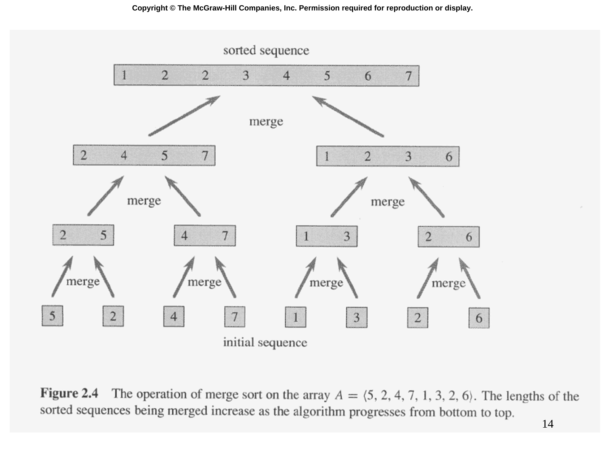

# Slide 14 — MERGE-SORT Example (歸併排序範例)

## 📖 Original Text / 原文

### 🖼️ Original Slides / 原始投影片



---

**Figure 2.4** The operation of merge sort on the array $A = (5, 2, 4, 7, 1, 3, 2, 6)$. The lengths of the sorted sequences being merged increase as the algorithm progresses from bottom to top.

## 🇹🇼 Chinese Translation / 中文翻譯

**圖 2.4** 歸併排序在陣列 $A = (5, 2, 4, 7, 1, 3, 2, 6)$ 上的操作過程。隨著演算法從下到上進行，正在合併的已排序序列的長度逐漸增加。

## 💡 Detailed Explanation / 詳細解釋

這張圖展示了歸併排序對 $A = (5, 2, 4, 7, 1, 3, 2, 6)$ 的完整執行過程（自底向上）：

**分解階段（由上而下）**：
```
(5, 2, 4, 7, 1, 3, 2, 6)
├── (5, 2, 4, 7)
│   ├── (5, 2)
│   │   ├── (5)
│   │   └── (2)
│   └── (4, 7)
│       ├── (4)
│       └── (7)
└── (1, 3, 2, 6)
    ├── (1, 3)
    │   ├── (1)
    │   └── (3)
    └── (2, 6)
        ├── (2)
        └── (6)
```

**合併階段（由下而上）**：
1. $(5)$ + $(2)$ → $(2, 5)$
2. $(4)$ + $(7)$ → $(4, 7)$
3. $(1)$ + $(3)$ → $(1, 3)$
4. $(2)$ + $(6)$ → $(2, 6)$
5. $(2, 5)$ + $(4, 7)$ → $(2, 4, 5, 7)$
6. $(1, 3)$ + $(2, 6)$ → $(1, 2, 3, 6)$
7. $(2, 4, 5, 7)$ + $(1, 2, 3, 6)$ → $(1, 2, 2, 3, 4, 5, 6, 7)$

**遞迴深度**：$\lg 8 = 3$ 層，每層合併總共 $\Theta(8) = \Theta(n)$ 時間。

**總時間**：$\Theta(n \lg n)$ ✓
