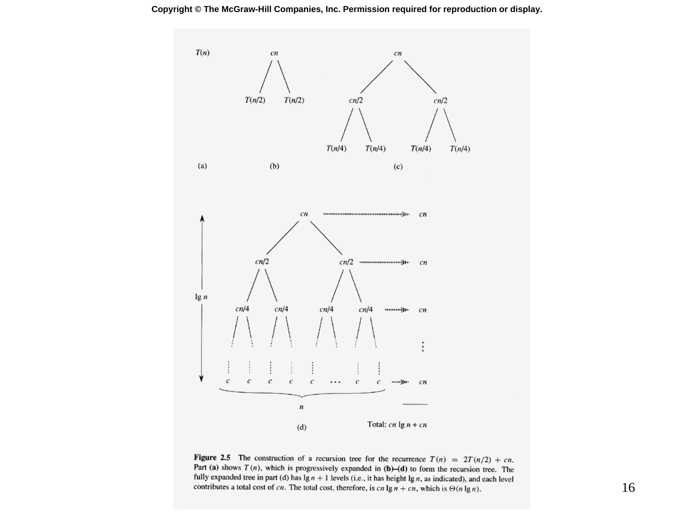

# Slide 16 — Recursion Tree (遞迴樹)

## 📖 Original Text / 原文

### 🖼️ Original Slides / 原始投影片



---

**Figure 2.5** The construction of a recursion tree for the recurrence $T(n) = 2T(n/2) + cn$. Part (a) shows $T(n)$, which is progressively expanded in (b)-(d) to form the recursion tree. The fully expanded tree in part (d) has $\lg n + 1$ levels (i.e., it has height $\lg n$, as indicated), and each level contributes a total cost of $cn$. The total cost, therefore, is $cn \lg n + cn$, which is $\Theta(n \lg n)$.

## 🇹🇼 Chinese Translation / 中文翻譯

**圖 2.5** 遞迴式 $T(n) = 2T(n/2) + cn$ 的遞迴樹建構過程。部分 (a) 顯示 $T(n)$，在 (b)-(d) 中逐步展開形成遞迴樹。完全展開的樹在部分 (d) 中有 $\lg n + 1$ 層（即高度為 $\lg n$），每層貢獻的總成本為 $cn$。因此，總成本為 $cn \lg n + cn$，即 $\Theta(n \lg n)$。

## 💡 Detailed Explanation / 詳細解釋

**遞迴樹（Recursion Tree）**是視覺化遞迴式展開過程的方法：

```
                    T(n)
                   /  \
           cn/2  /      \  cn/2     ← Level 0: cost = cn
             /  \        /  \
        cn/4 /      \ cn/4 cn/4 / \ cn/4  ← Level 1: cost = cn
          / \        / \   / \        / \
        cn/8 ...    cn/8 ... cn/8 ... cn/8  ← Level 2: cost = cn
         ...
        /              \
       T(1)             T(1)                 ← Level lg n: cost = cn
```

## 🔢 Derivation Process / 推導過程

**遞迴樹分析**：

| 項目 | 值 |
|------|-----|
| 每層成本 | $cn$ |
| 層數（高度） | $\lg n$ |
| 葉子節點數 | $n$ |
| 葉子層成本 | $n \cdot \Theta(1) = \Theta(n) = cn$ |

**總成本**：

$$T(n) = \underbrace{cn + cn + \cdots + cn}_{\lg n \text{ levels}} + \underbrace{cn}_{\text{leaf level}} = cn(\lg n + 1) = \Theta(n \lg n)$$

這就是為什麼歸併排序的時間複雜度是 $\Theta(n \lg n)$！
