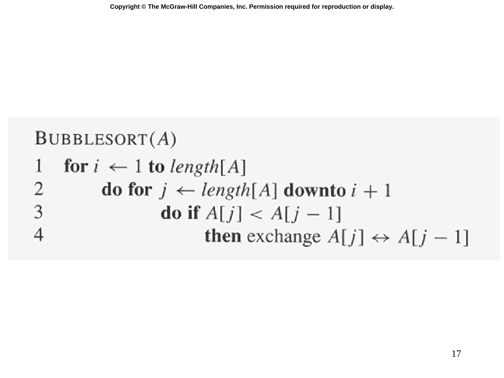

# Slide 17 — BUBBLE-SORT (氣泡排序)

## 📖 Original Text / 原文

---



## 🇹🇼 Chinese Translation / 中文翻譯

**氣泡排序(A)**

```
1   for i ← 1 到 length[A]
2     do for j ← length[A] downto i+1
3       do if A[j] < A[j-1]
4         then 交換 A[j] ↔ A[j-1]
```

## 💡 Detailed Explanation / 詳細解釋

**氣泡排序（Bubble Sort）**是另一種簡單的排序演算法：

**運作原理**：
- 外迴圈從 $i = 1$ 開始
- 內迴圈從陣列末尾向下掃描到 $i+1$
- 如果相鄰元素逆序，就交換它們
- 每輪外迴圈後，最小的未排序元素「浮到」位置 $i$（像氣泡一樣上浮）

**與插入排序的比較**：

| 特性 | 插入排序 | 氣泡排序 |
|------|---------|---------|
| 最佳情況 | $\Theta(n)$ | $\Theta(n^2)$（此版本） |
| 最壞情況 | $\Theta(n^2)$ | $\Theta(n^2)$ |
| 空間 | $O(1)$ | $O(1)$ |
| 穩定性 | 穩定 | 穩定 |
| 實務效能 | 較好（利用已有順序） | 較差 |

氣泡排序雖然簡單，但在實務上幾乎不會被使用，因為它的效能不如插入排序。

## 🔢 Derivation Process / 推導過程

**時間複雜度分析**：

外迴圈執行 $n$ 次，內迴圈在第 $i$ 次外迴圈時執行 $n - i$ 次：

$$T(n) = \sum_{i=1}^{n} \sum_{j=i+1}^{n} 1 = \sum_{i=1}^{n} (n-i) = \frac{n(n-1)}{2} = \Theta(n^2)$$

**注意**：可以優化氣泡排序（加入 early-stop flag），使最佳情況達到 $\Theta(n)$，但這不是這版擬似碼的行為。
