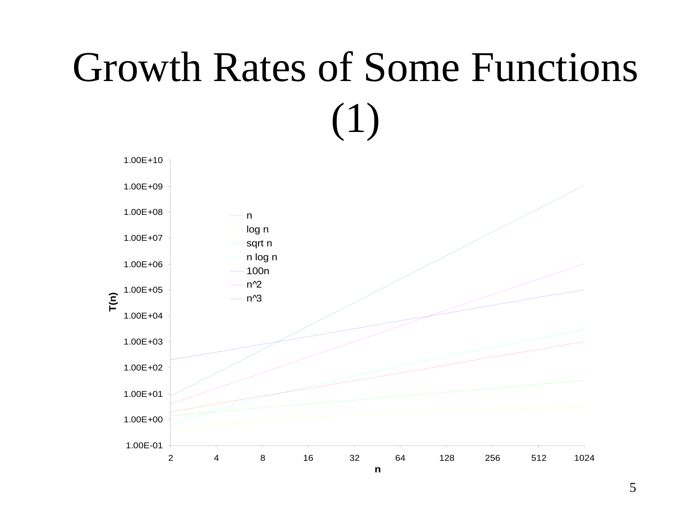
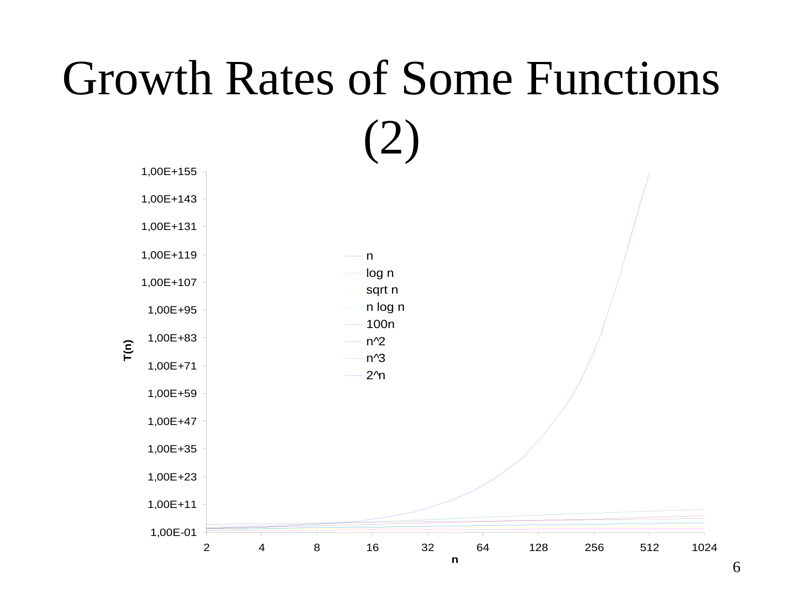

# Chapter 3: Growth of Functions / 函數增長率

---

## 3.1 Introduction / 引言

---

### 📖 Original Text / 原文

**Introduction to Algorithms Second Edition by Cormen, Leiserson, Rivest & Stein**

**Chapter 3**

---

### 🇹🇼 Chinese Translation / 中文翻譯

**演算法導論第二版 — Cormen, Leiserson, Rivest & Stein**

**第三章**

---

### 💡 Detailed Explanation / 詳細解釋

本章是 CLRS（《演算法導論》）的第三章，主題為「函數的增長率」（Growth of Functions）。這一章介紹漸近符號（asymptotic notation），用於描述演算法執行時間隨著輸入規模增長的趨勢。這是分析演算法效率的數學基礎。

---

## 3.2 Overview / 總覽

---

### 📖 Original Text / 原文

**Overview**

- **Order** of **growth of functions** provides a simple characterization of efficiency
- Allows for comparison of relative performance between alternative algorithms
- Concerned with **asymptotic efficiency** of algorithms
- Best asymptotic efficiency usually is best choice **except for smaller inputs**
- Several standard methods to simplify asymptotic analysis of algorithms

---

### 🇹🇼 Chinese Translation / 中文翻譯

**總覽**

- 函數的**增長階**（order of growth）提供演算法效率的簡潔描述
- 允許比較不同演算法之間的相對效能
- 關注演算法的**漸近效率**（asymptotic efficiency）
- 漸近效率最佳者通常是最優選擇**（小輸入時除外）**
- 有多種標準方法可簡化演算法的漸近分析

---

### 💡 Detailed Explanation / 詳細解釋

這一節概述了本章的核心概念：

1. **增長階（Order of Growth）**：我們不關心演算法在特定機器上的精確執行時間，而是關心當輸入規模 $n$ 趨於無窮大時，執行時間函數 $T(n)$ 的「增長趨勢」。例如，$3n^2 + 100n + 5$ 的增長階是 $n^2$。

2. **為什麼忽略小輸入？** 漸近分析假設 $n$ 夠大。在實務上，對於小輸入，常數因子和低階項的影響可能比高階項更大，但隨著 $n$ 增大，高階項會主導整體行為。

3. **比較效能**：透過增長階，我們可以判斷 $O(n \log n)$ 的排序演算法永遠比 $O(n^2)$ 的演算法在 $n$ 夠大時更快。

---

## 3.3 Asymptotic Analysis / 漸近分析

---

### 📖 Original Text / 原文

**Asymptotic Analysis**

- Asymptotic analysis is analyzing what happens to the run time (or other performance metric) as the input size $n$ goes to infinity
- The word comes from "asymptote", which is where you look at the limiting behavior of a function as something goes to infinity
- This gives a solid mathematical way to capture the intuition of emphasizing scalable performance
- It also makes the analysis a lot simpler!

---

### 🇹🇼 Chinese Translation / 中文翻譯

**漸近分析**

- 漸近分析是研究當輸入規模 $n$ 趨向無窮大時，執行時間（或其他效能指標）的行為
- 這個詞源自「漸近線」（asymptote），指當某變量趨向無窮時函數的極限行為
- 這為「強調可擴展效能」的直覺提供了嚴謹的數學框架
- 它也大幅簡化了分析過程！

---

### 💡 Detailed Explanation / 詳細解釋

**漸近線（Asymptote）的直覺：**

在微積分中，函數 $y = 1/x$ 當 $x \to \infty$ 時，曲線無限接近 $x$ 軸但不觸碰——$x$ 軸就是漸近線。在演算法分析中，我們關心的是：當 $n \to \infty$ 時，執行時間函數 $T(n)$ 的「增長趨勢」是什麼。

**為什麼這樣做？**

- 忽略機器相關的常數因子（CPU 速度、記憶體頻寬等）
- 忽略低階項和常數（在小 $n$ 時有影響，但在大 $n$ 時可忽略）
- 讓分析更簡潔且更具通用性

**例子：** 如果 $T(n) = 3n^2 + 100n + 5$，當 $n$ 很大時，$3n^2$ 主導了整個式子，所以我們說 $T(n)$ 的增長階是 $n^2$。

---

## 3.4 Asymptotic Notation / 漸近符號

---

### 📖 Original Text / 原文

**Asymptotic Notation**

- Applies to functions whose domains are the set of natural numbers: $\mathbb{N} = \{0, 1, 2, \ldots\}$
- Such notations are convenient for describing the worst-case running time function $T(n)$, where the input size $n$ is large enough
- If time resource $T(n)$ is being analyzed, the function's range is usually the set of non-negative real numbers: $T(n) \in \mathbb{R}^+$ (abused)

---

### 🇹🇼 Chinese Translation / 中文翻譯

**漸近符號**

- 適用於定義域為自然數集的函數：$\mathbb{N} = \{0, 1, 2, \ldots\}$
- 這些符號方便用於描述最壞情況執行時間函數 $T(n)$，其中輸入規模 $n$ 足夠大
- 如果分析的是時間資源 $T(n)$，函數的值域通常是非負實數集：$T(n) \in \mathbb{R}^+$（濫用符號）

---

### 💡 Detailed Explanation / 詳細解釋

**為什麼定義域是自然數？**

演算法的輸入規模 $n$ 必然是非負整數（你不能有 3.5 個元素）。所以漸近符號處理的是定義域為 $\mathbb{N}$ 的函數。

**為什麼值域是非負實數？**

執行時間必須是非負的。我們用 $\mathbb{R}^+$ 表示非負實數集（嚴格來說 $\mathbb{R}^+$ 指正實數，但這裡「濫用」為包含零）。

**漸近符號的意義：**

漸近符號提供了一套標準化的語言來描述函數的增長上界、下界和緊界。本章將介紹五種符號：$\Theta$（緊界）、$O$（上界）、$\Omega$（下界）、$o$（嚴格上界）、$\omega$（嚴格下界）。

---

## 3.5 Growth Rates of Some Functions / 一些函數的增長率

---

### 📖 Original Text / 原文

**Growth Rates of Some Functions (1)**

---

**Growth Rates of Some Functions (2)**

---

---

### 🇹🇼 Chinese Translation / 中文翻譯

**一些函數的增長率（1）**

圖表顯示以下函數的增長率：

| 函數 | 說明 |
|------|------|
| $\log n$ | 對數級 |
| $\sqrt{n}$ | 平方根 |
| $n$ | 線性 |
| $n \log n$ | 線性對數 |
| $100n$ | 線性（帶常數因子） |
| $n^2$ | 二次方 |
| $n^3$ | 三次方 |

X 軸：$n = 2, 4, 8, 16, 32, 64, 128, 256, 512, 1024$

Y 軸：$T(n)$（對數刻度：$10^{-1}$ 到 $10^{10}$）

**一些函數的增長率（2）**

擴展圖表顯示額外函數：

| 函數 | 說明 |
|------|------|
| $\log n$ | 對數級 |
| $\sqrt{n}$ | 平方根 |
| $n$ | 線性 |
| $n \log n$ | 線性對數 |
| $100n$ | 線性（帶常數因子） |
| $n^2$ | 二次方 |
| $n^3$ | 三次方 |
| $2^n$ | 指數 |

Y 軸延伸至 $10^{155}$（顯示 $2^n$ 的驚人增長速度）

---

### 💡 Detailed Explanation / 詳細解釋

**增長率由小到大的排列：**

$$\log n \ll \sqrt{n} \ll n \ll n \log n \ll n^2 \ll n^3 \ll 2^n$$

**重要觀察：**

1. **常數因子不重要**：$100n$ 和 $n$ 都是線性增長，只是 $100n$ 的常數因子較大。在漸近分析中，$100n = \Theta(n)$，常數因子被忽略。

2. **$n \log n$ 夾在 $n$ 和 $n^2$ 之間**：這是一個常見的時間複雜度（合併排序、快速排序的平均情況）。它比線性慢但比二次方快得多。

3. **指數增長的可怕**：$2^n$ 在 $n = 128$ 時達到 $10^{38}$ 以上，這意味著對於稍大的輸入，指數時間演算法完全不可行。

4. **對數刻度**：圖表使用對數刻度（Y 軸），這是因為不同函數之間的數值差異太大（跨越多個數量級），線性刻度無法有效展示。

---

### 🔢 Derivation Process / 推導過程

**為什麼 $n \log n$ 在 $n$ 和 $n^2$ 之間？**

$$n < n \log n < n^2 \quad \text{（當 } n > 2 \text{ 時）}$$

證明：
- $n < n \log n$：因為當 $n > 2$ 時 $\log n > 1$，所以 $n \log n > n$
- $n \log n < n^2$：因為當 $n > 1$ 時 $\log n < n$，所以 $n \log n < n \cdot n = n^2$

**為什麼常數因子被忽略？**

對於 $100n$：
$$\lim_{n \to \infty} \frac{100n}{n} = 100$$

在漸近分析中，$100n$ 和 $n$ 屬於同一增長階（都是 $\Theta(n)$），因為它們的比值是有界常數。
