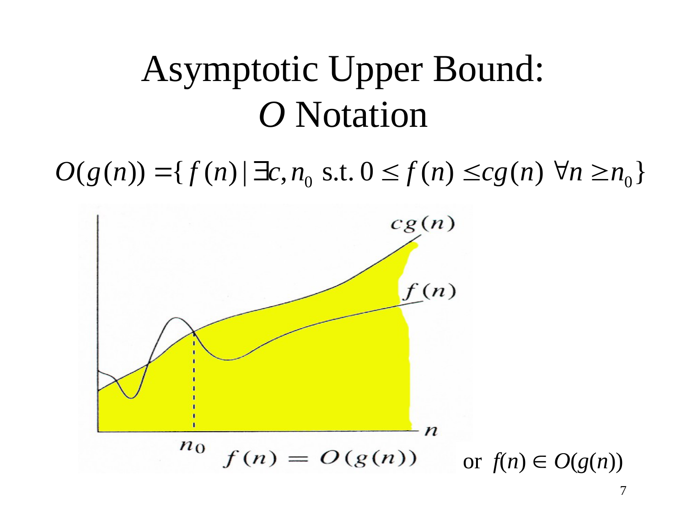
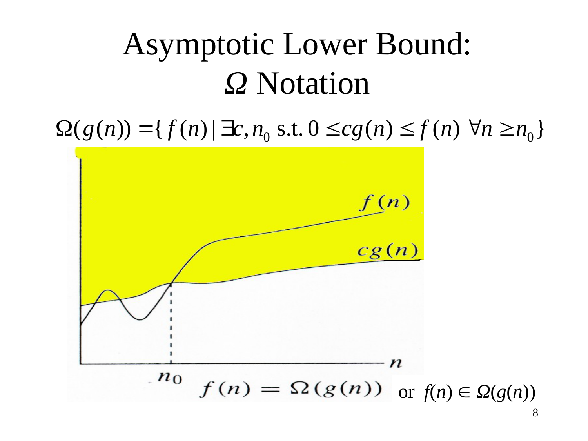
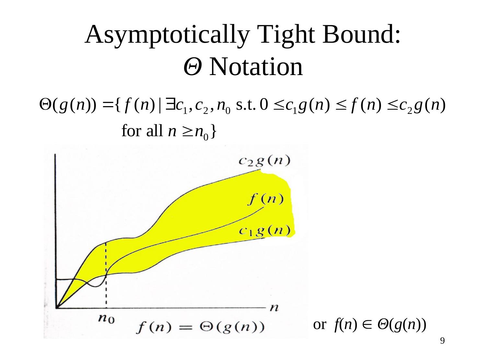
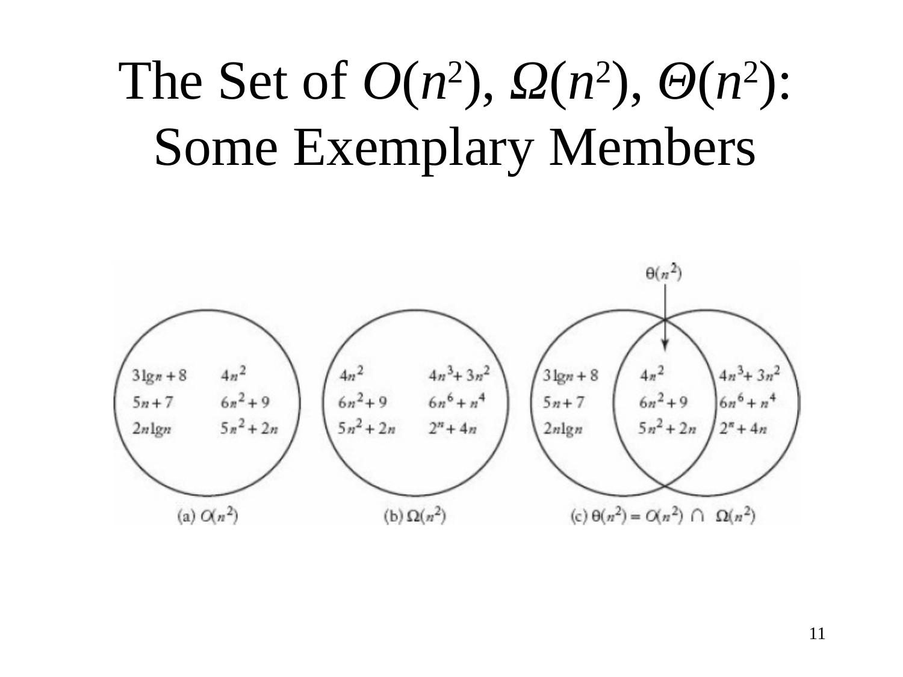
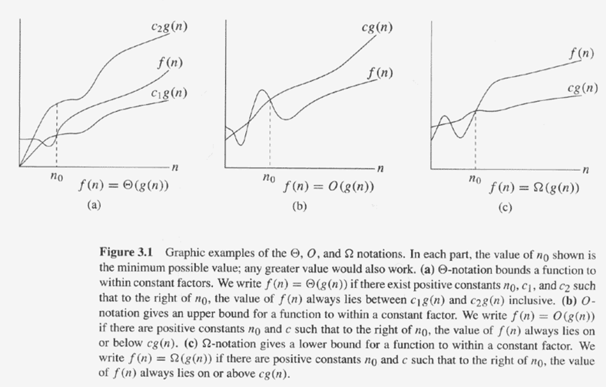

# Chapter 3: Asymptotic Notations / 漸近符號

---

## 3.6 Asymptotic Upper Bound: $O$ Notation / 漸近上界

---

### 📖 Original Text / 原文

---

---

### 🇹🇼 Chinese Translation / 中文翻譯

**漸近上界：$O$ 符號**

$$O(g(n)) = \{ f(n) \mid \exists c, n_0 \text{ s.t. } 0 \le f(n) \le c \cdot g(n), \forall n \ge n_0 \}$$

或 $f(n) \in O(g(n))$

---

### 💡 Detailed Explanation / 詳細解釋

**直覺理解：**

$O(g(n))$ 表示「$f(n)$ 的增長速度不超過 $g(n)$」。也就是說，$g(n)$ 是 $f(n)$ 的**上界**（upper bound）。

**形式化定義的解讀：**

- $\exists c, n_0$：存在某個常數 $c$ 和某個閾值 $n_0$
- $0 \le f(n) \le c \cdot g(n)$：對於所有 $n \ge n_0$，$f(n)$ 都被 $c \cdot g(n)$ 從上方限制
- $\forall n \ge n_0$：這個不等式在 $n$ 足夠大時成立

**例子：**

- $2n + 3 \in O(n)$：取 $c = 3, n_0 = 3$，則 $2n + 3 \le 3n$ 對所有 $n \ge 3$ 成立
- $n^2 \in O(n^3)$：取 $c = 1, n_0 = 1$，則 $n^2 \le n^3$ 對所有 $n \ge 1$ 成立
- $n^2 \notin O(n)$：不存在任何 $c, n_0$ 使得 $n^2 \le c \cdot n$ 對所有 $n \ge n_0$ 成立

**注意：** $O$ 符號是「大於等於」關係的上界版本。$f(n) \in O(g(n))$ 不意味著 $f(n)$ 一定比 $g(n)$ 小——它可能等價。例如 $n^2 \in O(n^2)$ 也是正確的。

---

## 3.7 Asymptotic Lower Bound: $\Omega$ Notation / 漸近下界

---

### 📖 Original Text / 原文

---

---

### 🇹🇼 Chinese Translation / 中文翻譯

**漸近下界：$\Omega$ 符號**

$$\Omega(g(n)) = \{ f(n) \mid \exists c, n_0 \text{ s.t. } 0 \le c \cdot g(n) \le f(n), \forall n \ge n_0 \}$$

或 $f(n) \in \Omega(g(n))$

---

### 💡 Detailed Explanation / 詳細解釋

**直覺理解：**

$\Omega(g(n))$ 表示「$f(n)$ 的增長速度至少和 $g(n)$ 一樣快」。也就是說，$g(n)$ 是 $f(n)$ 的**下界**（lower bound）。

**與 $O$ 符號的對偶性：**

$\Omega$ 是 $O$ 的「鏡像」版本。把 $O$ 定義中的不等號方向翻轉，就得到 $\Omega$：
- $O$: $f(n) \le c \cdot g(n)$（$f$ 在 $g$ 之下）
- $\Omega$: $c \cdot g(n) \le f(n)$（$f$ 在 $g$ 之上）

**例子：**

- $2n^2 + 3n + 1 \in \Omega(n^2)$：取 $c = 2, n_0 = 0$，則 $2n^2 \le 2n^2 + 3n + 1$ 對所有 $n \ge 0$ 成立
- $n \in \Omega(1)$：取 $c = 1, n_0 = 1$，則 $1 \le n$ 對所有 $n \ge 1$ 成立
- $n \notin \Omega(n^2)$：不存在 $c, n_0$ 使得 $c \cdot n^2 \le n$ 對所有 $n \ge n_0$ 成立

---

## 3.8 Asymptotically Tight Bound: $\Theta$ Notation / 漸近緊界

---

### 📖 Original Text / 原文

---

---

### 🇹🇼 Chinese Translation / 中文翻譯

**漸近緊界：$\Theta$ 符號**

$$\Theta(g(n)) = \{ f(n) \mid \exists c_1, c_2, n_0 \text{ s.t. } 0 \le c_1 \cdot g(n) \le f(n) \le c_2 \cdot g(n), \forall n \ge n_0 \}$$

或 $f(n) \in \Theta(g(n))$

---

### 💡 Detailed Explanation / 詳細解釋

**直覺理解：**

$\Theta(g(n))$ 表示「$f(n)$ 的增長速度和 $g(n)$ **相同**（在常數因子範圍內）」。也就是說，$g(n)$ 同時是 $f(n)$ 的上界和下界——這就是「緊界」（tight bound）的含義。

**$\Theta$ 與 $O$、$\Omega$ 的關係：**

$$f(n) \in \Theta(g(n)) \iff f(n) \in O(g(n)) \text{ 且 } f(n) \in \Omega(g(n))$$

也就是說，$\Theta(g(n)) = O(g(n)) \cap \Omega(g(n))$。

**例子：**

- $2n^2 + 3n + 1 \in \Theta(n^2)$：
  - 上界：$2n^2 + 3n + 1 \le 6n^2$（取 $c_2 = 6, n_0 = 1$）
  - 下界：$2n^2 + 3n + 1 \ge 2n^2$（取 $c_1 = 2, n_0 = 0$）
- $\frac{1}{2}n^2 - 3n \in \Theta(n^2)$：
  - 上界：$\frac{1}{2}n^2 - 3n \le \frac{1}{2}n^2$（取 $c_2 = \frac{1}{2}, n_0 = 0$）
  - 下界：$\frac{1}{2}n^2 - 3n \ge \frac{1}{8}n^2$（取 $c_1 = \frac{1}{8}, n_0 = 8$）

---

## 3.9 The Sets $O(n^2)$, $\Omega(n^2)$, $\Theta(n^2)$ / 集合關係

---

### 📖 Original Text / 原文

---

---

### 🇹🇼 Chinese Translation / 中文翻譯

**$O(n^2)$, $\Omega(n^2)$, $\Theta(n^2)$ 的集合：一些典型成員**

一些典型成員：

| $O(n^2)$ | $\Omega(n^2)$ |
|----------|--------------|
| $\frac{n^2}{\log n}$ | $n^2 \log n$ |
| $n^2$ | $n^3$ |
| $n^2 \log \log n$ | $2^{n^2}$ |
| $n^2 (\log n)^2$ | |
| $n^{2.5}$ | |
| $n^2 \log n$ | |

交集 $\Theta(n^2) = \{n^2\}$

---

### 💡 Detailed Explanation / 詳細解釋

**維恩圖（Venn Diagram）直覺：**

想像一個維恩圖，左圓是 $O(n^2)$（增長不超過 $n^2$ 的函數），右圓是 $\Omega(n^2)$（增長至少和 $n^2$ 一樣快的函數），兩者的交集是 $\Theta(n^2)$（增長正好和 $n^2$ 同階的函數）。

**重要觀察：**

1. **$O(n^2)$ 包含比 $n^2$ 增長更慢的函數**：$\frac{n^2}{\log n}$、$n^2$ 都在 $O(n^2)$ 中
2. **$\Omega(n^2)$ 包含比 $n^2$ 增長更快的函數**：$n^2 \log n$、$n^3$、$2^{n^2}$ 都在 $\Omega(n^2)$ 中
3. **$\Theta(n^2)$ 只包含與 $n^2$ 同階的函數**：在這個例子中只有 $n^2$ 本身

**為什麼 $n^2 \log n \in O(n^2)$？（常見誤解）**

其實 $n^2 \log n \notin O(n^2)$！因為 $\lim_{n \to \infty} \frac{n^2 \log n}{n^2} = \lim_{n \to \infty} \log n = \infty$。它應該在 $\Omega(n^2)$ 中而不是 $O(n^2)$ 中。

---

## 3.10 Figure 3.1: Graphic Examples / 圖形示例

---

### 📖 Original Text / 原文

---

**Figure 3.1** Graphic examples of the Θ, O, and Ω notations. In each part, the value of $n_0$ shown is the minimum possible value; any greater value would also work.

- **(a) Θ-notation** bounds a function to within constant factors. We write $f(n) = \Theta(g(n))$ if there exist positive constants $n_0$, $c_1$, and $c_2$ such that to the right of $n_0$, the value of $f(n)$ always lies between $c_1 g(n)$ and $c_2 g(n)$ inclusive.

- **(b) O-notation** gives an upper bound for a function to within a constant factor. We write $f(n) = O(g(n))$ if there are positive constants $n_0$ and $c$ such that to the right of $n_0$, the value of $f(n)$ always lies on or below $c g(n)$.

- **(c) Ω-notation** gives a lower bound for a function to within a constant factor. We write $f(n) = \Omega(g(n))$ if there are positive constants $n_0$ and $c$ such that to the right of $n_0$, the value of $f(n)$ always lies on or above $c g(n)$.

---

### 🇹🇼 Chinese Translation / 中文翻譯

**圖 3.1** Θ、O 和 Ω 符號的圖形示例。每個部分中，顯示的 $n_0$ 值是最小可能值；任何更大的值也同樣適用。

- **(a) Θ 符號** 在常數因子範圍內界定函數值。若存在正常數 $n_0$、$c_1$、$c_2$，使得在 $n_0$ 的右側，$f(n)$ 的值始終落在 $c_1 g(n)$ 與 $c_2 g(n)$ 之間（含端點），則記為 $f(n) = \Theta(g(n))$。

- **(b) O 符號** 在常數因子範圍內給出函數的上界。若存在正常數 $n_0$ 和 $c$，使得在 $n_0$ 的右側，$f(n)$ 的值始終落在 $c g(n)$ 上或以下的區域，則記為 $f(n) = O(g(n))$。

- **(c) Ω 符號** 在常數因子範圍內給出函數的下界。若存在正常數 $n_0$ 和 $c$，使得在 $n_0$ 的右側，$f(n)$ 的值始終落在 $c g(n)$ 上或以上的區域，則記為 $f(n) = \Omega(g(n))$。

---

### 💡 Detailed Explanation / 詳細解釋

**圖形 vs. 代數定義：**

這張圖是 CLRS 課本中最經典的插圖之一，用視覺化的方式總結了三種核心漸近符號的直覺：

| 符號 | 不等式 | 圖形 | 關鍵概念 |
|------|--------|------|----------|
| $\Theta$ | $c_1 g(n) \le f(n) \le c_2 g(n)$ | 面板 (a) | $f(n)$ 被**夾**在兩條 $c \cdot g(n)$ 線之間 |
| $O$ | $f(n) \le c g(n)$ | 面板 (b) | $f(n)$ 在 $c g(n)$ 的**下方** |
| $\Omega$ | $c g(n) \le f(n)$ | 面板 (c) | $f(n)$ 在 $c g(n)$ 的**上方** |

**$n_0$ 的角色（關鍵！）：**

圖中 $n_0$ 是一個「分界點」——定義只要求不等式在 $n \ge n_0$ 之後成立。$n_0$ 之前發生什麼事完全無關緊要。事實上，**$f(n)$ 在 $n < n_0$ 時可以比 $c g(n)$ 大（對 $O$ 而言）、或比 $c g(n)$ 小（對 $\Omega$ 而言）**——這在圖中可以清楚地看到：面板 (b) 中 $f(n)$ 在 $n_0$ 前確實高於 $c g(n)$！

**三張子圖的統一解讀：**

- **(a) $\Theta$**：暗色區域是 $f(n)$ 必須落在其中的範圍——被夾在 $c_1 g(n)$（下界）和 $c_2 g(n)$（上界）之間
- **(b) $O$**：暗色區域是 $f(n)$ 允許的範圍——在 $c g(n)$ 以下
- **(c) $\Omega$**：暗色區域是 $f(n)$ 允許的範圍——在 $c g(n)$ 以上

**與 3.6–3.8 節的搭配：**

這張圖是回顧性的總結圖，建議在讀完 3.6（$O$）、3.7（$\Omega$）、3.8（$\Theta$）後回來仔細端詳，會對三者的區別有更深的理解。

---

## 3.11 Simplifying the Analysis / 簡化分析

---

### 📖 Original Text / 原文

**Simplifying the Analysis**

- Intuition: Throw away low-order terms and ignore the leading coefficient of the highest-order term
- Justifying this intuition by using the formal definition

---

### 🇹🇼 Chinese Translation / 中文翻譯

**簡化分析**

- 直覺：丟掉低階項，忽略最高階項的係數
- 使用形式化定義來驗證這個直覺

---

### 💡 Detailed Explanation / 詳細解釋

**簡化規則：**

對於多項式 $a_k n^k + a_{k-1} n^{k-1} + \cdots + a_1 n + a_0$：
1. 只保留最高階項 $a_k n^k$
2. 忽略係數 $a_k$
3. 結果：$\Theta(n^k)$

**例子：**

| 原始函數 | 簡化後 | 理由 |
|----------|--------|------|
| $3n^3 + 100n^2 + 200n + 5$ | $\Theta(n^3)$ | 最高階是 $n^3$ |
| $n^2 + n \log n + n$ | $\Theta(n^2)$ | 最高階是 $n^2$ |
| $1000n + 5000$ | $\Theta(n)$ | 最高階是 $n$ |

**為什麼可以這樣簡化？**

因為當 $n \to \infty$ 時，最高階項主導了整個表達式的值。低階項和常數因子在漸近意義下可以被忽略。

---

## 3.12 Exercises / 練習題

---

### 📖 Original Text / 原文

**Exercises**

- $2n^2 + 4n = \Theta(n^2)$
- $n^3 + 20n + 1 = O(n^4)$?
- $2^{n+1} = O(2^n)$?
- $2^{2n} = O(2^n)$?
- $\frac{1}{2}n^2 - 3n = \Theta(n^2)$?
- $\lg(n!) = \Theta(\lg(n^n))$?

---

### 🇹🇼 Chinese Translation / 中文翻譯

**練習題**

- $2n^2 + 4n = \Theta(n^2)$
- $n^3 + 20n + 1 = O(n^4)$？
- $2^{n+1} = O(2^n)$？
- $2^{2n} = O(2^n)$？
- $\frac{1}{2}n^2 - 3n = \Theta(n^2)$？
- $\lg(n!) = \Theta(\lg(n^n))$？

---

### 🔢 Derivation Process / 推導過程

**練習 1：$2n^2 + 4n = \Theta(n^2)$**

證明：需要找到 $c_1, c_2, n_0$ 使得 $c_1 n^2 \le 2n^2 + 4n \le c_2 n^2$。

- 上界：$2n^2 + 4n \le 2n^2 + 4n^2 = 6n^2$（當 $n \ge 1$），取 $c_2 = 6, n_0 = 1$
- 下界：$2n^2 + 4n \ge 2n^2$（當 $n \ge 0$），取 $c_1 = 2, n_0 = 1$

✅ 成立，$2n^2 + 4n = \Theta(n^2)$

---

**練習 2：$n^3 + 20n + 1 = O(n^4)$？**

證明：需要找到 $c, n_0$ 使得 $n^3 + 20n + 1 \le c \cdot n^4$。

- 當 $n \ge 1$：$n^3 + 20n + 1 \le n^3 + 20n^3 + n^3 = 22n^3 \le 22n^4$
- 取 $c = 22, n_0 = 1$

✅ 成立，$n^3 + 20n + 1 = O(n^4)$

---

**練習 3：$2^{n+1} = O(2^n)$？**

$$2^{n+1} = 2 \cdot 2^n$$

取 $c = 2, n_0 = 0$，則 $2^{n+1} \le 2 \cdot 2^n$ 對所有 $n \ge 0$ 成立。

✅ 成立，$2^{n+1} = O(2^n)$

---

**練習 4：$2^{2n} = O(2^n)$？**

$$\frac{2^{2n}}{2^n} = \frac{2^{2n}}{2^n} = 2^n \to \infty \quad \text{（當 } n \to \infty \text{）}$$

$$2^{2n} = 4^n$$

對於任何固定的 $c$，當 $n > \log_2 c$ 時，$4^n > c \cdot 2^n$。

❌ 不成立，$2^{2n} \neq O(2^n)$

---

**練習 5：$\frac{1}{2}n^2 - 3n = \Theta(n^2)$？**

證明：需要找到 $c_1, c_2, n_0$ 使得 $c_1 n^2 \le \frac{1}{2}n^2 - 3n \le c_2 n^2$。

- 上界：$\frac{1}{2}n^2 - 3n \le \frac{1}{2}n^2$（因為 $-3n \le 0$），取 $c_2 = \frac{1}{2}, n_0 = 1$
- 下界：$\frac{1}{2}n^2 - 3n \ge \frac{1}{8}n^2$（當 $n \ge 8$ 時，$-3n \ge -\frac{3}{8}n^2$），取 $c_1 = \frac{1}{8}, n_0 = 8$

✅ 成立，$\frac{1}{2}n^2 - 3n = \Theta(n^2)$

---

**練習 6：$\lg(n!) = \Theta(\lg(n^n))$？**

首先：$\lg(n^n) = n \lg n$

使用 **Stirling 近似**（Stirling's approximation）：
$$n! \approx \sqrt{2\pi n} \left(\frac{n}{e}\right)^n$$

取對數：
$$\lg(n!) \approx \lg\left(\sqrt{2\pi n} \left(\frac{n}{e}\right)^n\right) = \frac{1}{2}\lg(2\pi n) + n\lg n - n\lg e$$

$$\lg(n!) = n\lg n - n\lg e + O(\lg n) = \Theta(n \lg n)$$

同時 $\lg(n^n) = n\lg n = \Theta(n\lg n)$

✅ 成立，$\lg(n!) = \Theta(\lg(n^n)) = \Theta(n \lg n)$

---

## 3.13 Strictly Less Than: $o$ Notation / 嚴格小於

---

### 📖 Original Text / 原文

**Strictly less than: $o$ notation**

$$o(g(n)) = \{ f(n) \mid \forall \text{ positive constants } c, \exists n_0 > 0 \text{ s.t. } \forall n \ge n_0, 0 \le f(n) < c \cdot g(n) \}$$

$$f(n) \in o(g(n)) \iff \lim_{n \to \infty} \frac{f(n)}{g(n)} = 0$$

---

### 🇹🇼 Chinese Translation / 中文翻譯

**嚴格小於：$o$ 符號**

$$o(g(n)) = \{ f(n) \mid \forall \text{ 正常數 } c, \exists n_0 > 0 \text{ s.t. } \forall n \ge n_0, 0 \le f(n) < c \cdot g(n) \}$$

$$f(n) \in o(g(n)) \iff \lim_{n \to \infty} \frac{f(n)}{g(n)} = 0$$

---

### 💡 Detailed Explanation / 詳細解釋

**直覺理解：**

$o(g(n))$ 表示「$f(n)$ 的增長速度**嚴格慢於** $g(n)$」。注意這裡用的是「對於所有 $c$」（$\forall c$），而不是「存在某個 $c$」（$\exists c$）。

**與 $O$ 的區別：**

| 符號 | 量詞 | 不等式 | 含義 |
|------|------|--------|------|
| $O(g(n))$ | $\exists c$ | $f(n) \le c \cdot g(n)$ | $f$ 不超過 $g$（可等價） |
| $o(g(n))$ | $\forall c$ | $f(n) < c \cdot g(n)$ | $f$ 嚴格小於 $g$（不可等價） |

**極限判準（更方便使用）：**

$$f(n) \in o(g(n)) \iff \lim_{n \to \infty} \frac{f(n)}{g(n)} = 0$$

**例子：**

- $n \in o(n^2)$：因為 $\lim_{n \to \infty} \frac{n}{n^2} = \lim_{n \to \infty} \frac{1}{n} = 0$ ✅
- $n^2 \notin o(n^2)$：因為 $\lim_{n \to \infty} \frac{n^2}{n^2} = 1 \neq 0$ ❌
- $n \log n \in o(n^2)$：因為 $\lim_{n \to \infty} \frac{n \log n}{n^2} = \lim_{n \to \infty} \frac{\log n}{n} = 0$ ✅

---

## 3.14 Strictly Greater Than: $\omega$ Notation / 嚴格大於

---

### 📖 Original Text / 原文

**Strictly greater than: $\omega$ notation**

$$\omega(g(n)) = \{ f(n) \mid \forall \text{ positive constants } c, \exists n_0 > 0 \text{ s.t. } \forall n \ge n_0, 0 \le c \cdot g(n) < f(n) \}$$

$$f(n) \in \omega(g(n)) \iff \lim_{n \to \infty} \frac{f(n)}{g(n)} = \infty$$

---

### 🇹🇼 Chinese Translation / 中文翻譯

**嚴格大於：$\omega$ 符號**

$$\omega(g(n)) = \{ f(n) \mid \forall \text{ 正常數 } c, \exists n_0 > 0 \text{ s.t. } \forall n \ge n_0, 0 \le c \cdot g(n) < f(n) \}$$

$$f(n) \in \omega(g(n)) \iff \lim_{n \to \infty} \frac{f(n)}{g(n)} = \infty$$

---

### 💡 Detailed Explanation / 詳細解釋

**直覺理解：**

$\omega(g(n))$ 表示「$f(n)$ 的增長速度**嚴格快於** $g(n)$」。這是 $\Omega$ 的嚴格版本。

**與 $\Omega$ 的區別：**

| 符號 | 量詞 | 不等式 | 含義 |
|------|------|--------|------|
| $\Omega(g(n))$ | $\exists c$ | $c \cdot g(n) \le f(n)$ | $f$ 至少和 $g$ 一樣快（可等價） |
| $\omega(g(n))$ | $\forall c$ | $c \cdot g(n) < f(n)$ | $f$ 嚴格快於 $g$（不可等價） |

**極限判準：**

$$f(n) \in \omega(g(n)) \iff \lim_{n \to \infty} \frac{f(n)}{g(n)} = \infty$$

**例子：**

- $n^2 \in \omega(n)$：因為 $\lim_{n \to \infty} \frac{n^2}{n} = \lim_{n \to \infty} n = \infty$ ✅
- $n^2 \notin \omega(n^2)$：因為 $\lim_{n \to \infty} \frac{n^2}{n^2} = 1 \neq \infty$ ❌
- $2^n \in \omega(n^3)$：因為 $\lim_{n \to \infty} \frac{2^n}{n^3} = \infty$（指數增長快於任何多項式）✅

---

## 3.15 Summary of Asymptotic Notations / 漸近符號總結

---

### 💡 Detailed Explanation / 詳細解釋

**五種漸近符號的完整對比：**

| 符號 | 名稱 | 不等式 | 極限判準 | 含義 |
|------|------|--------|----------|------|
| $\Theta(g(n))$ | 緊界 | $c_1 g(n) \le f(n) \le c_2 g(n)$ | $0 < \lim \frac{f}{g} < \infty$ | 同階 |
| $O(g(n))$ | 上界 | $f(n) \le c \cdot g(n)$ | $\lim \frac{f}{g} \le c$ | 不超過 |
| $\Omega(g(n))$ | 下界 | $c \cdot g(n) \le f(n)$ | $\lim \frac{f}{g} \ge c$ | 至少 |
| $o(g(n))$ | 嚴格上界 | $f(n) < c \cdot g(n)$（對所有 $c$） | $\lim \frac{f}{g} = 0$ | 嚴格小於 |
| $\omega(g(n))$ | 嚴格下界 | $c \cdot g(n) < f(n)$（對所有 $c$） | $\lim \frac{f}{g} = \infty$ | 嚴格大於 |

**記憶技巧：**

- 大寫符號（$O, \Omega, \Theta$）對應「大於等於/小於等於」關係（$\le, \ge, =$）
- 小寫符號（$o, \omega$）對應「嚴格大於/嚴格小於」關係（$<, >$）
- $\Theta$ 是 $O$ 和 $\Omega$ 的交集：$\Theta(g) = O(g) \cap \Omega(g)$

**集合關係：**

- $o(g(n)) \subset O(g(n))$（嚴格上界是上界的子集）
- $\omega(g(n)) \subset \Omega(g(n))$（嚴格下界是下界的子集）
- $\Theta(g(n)) = O(g(n)) \cap \Omega(g(n))$
- $o(g(n)) \cap \omega(g(n)) = \emptyset$（空集）
